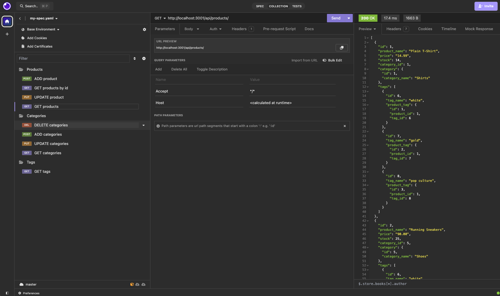
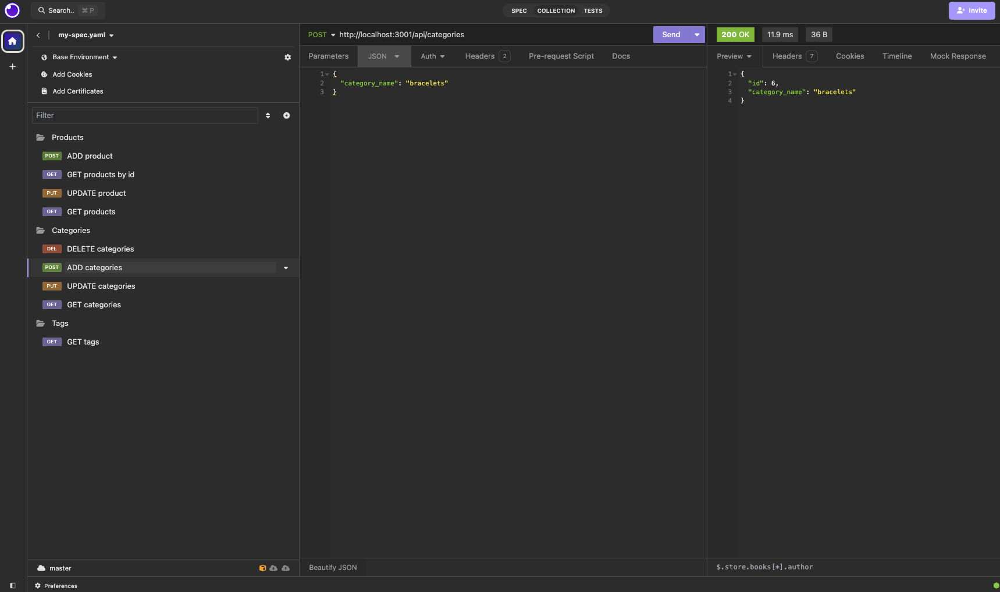

# ORM eCommerce Back-end

Ryan Hanzel

Bootcamp @ UT Austin | Module 13 Assignment

## Description
This application runs an express server with sequilize to allow MySQL database modifications/routes via the insomnia application.

## Links
[GitHub](https://github.com/h3xivall/ecommerce-back-end)

## Usage
- Clone the repo
- CD into the repo's root directory
- Ensure you MySQL server is running
- Fill in the necessary credentials inside of the .env file
- Run the commands:
  - ```npm install```
  - ```npm run seed```
  - ```npm run start```
- Run your insomnia application and point your collection to http://localhost:3001/api/
  - products
  - categories
  - tags
- You can now use GET, POST, PUT, and DELETE to look up and modify the different items

## Screenshots

